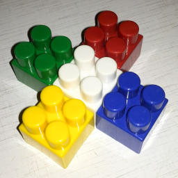

## Работа 2. Исследование каналов и JPEG-сжатия
автор: Мисютин В. А.
дата: 2022-02-24T22:28:17

<!-- url: https://github.com/DXXMWRLD/misyutin_v_a/tree/master/lab2 -->

### Задание
1. В качестве тестового использовать изображение data/cross_0256x0256.png
2. Сохранить тестовое изображение в формате JPEG с качеством 25%.
3. Используя cv::merge и cv::split сделать "мозаику" с визуализацией каналов для исходного тестового изображения и JPEG-версии тестового изображения
- левый верхний - трехканальное изображение
- левый нижний - монохромная (черно-зеленая) визуализация канала G
- правый верхний - монохромная (черно-красная) визуализация канала R
- правый нижний - монохромная (черно-синяя) визуализация канала B
4. Результы сохранить для вставки в отчет
5. Сделать мозаику из визуализации гистограммы для исходного тестового изображения и JPEG-версии тестового изображения, сохранить для вставки в отчет.


### Результаты

  
Рис. 1. Оригинальное тестовое изображение

  
Рис. 2. Тестовое изображение после сохранения в формате JPEG с качеством 25%

  
Рис. 3. Визуализация каналов исходного тестового изображения

  
Рис. 4. Визуализация каналов JPEG-версии тестового изображения

  
Рис. 5. Визуализация гистограм исходного тестового изображения

  
Рис. 6. Визуализация гистограм JPEG-версии тестового изображения  


### Текст программы

```cpp
//
// Created by dxxmwrld on 24.02.2022.
//

#include <opencv2/opencv.hpp>
#include <vector>

int main() {
std::string src_img_path = "../data/cross_0256x0256.png";
std::string image025_path = "./cross_0256x0256_025.jpg";

cv::Mat src_rgb_img = cv::imread(src_img_path);

imwrite("cross_0256x0256_025.jpg", src_rgb_img, {cv::IMWRITE_JPEG_QUALITY, 25});

cv::Mat img025 = cv::imread(image025_path);

int hist_size = 256;
float range[] = {0, 256};
const float *hist_range = {range};
int hist_w = 512;
int hist_h = 256;

cv::Mat bgr[3];
split(src_rgb_img, bgr);
cv::Mat color[3];
cv::Mat zero = cv::Mat::zeros(cv::Size(256, 256), CV_8UC1);
cv::Mat src_img_channel(512, 512, CV_8UC3);

cv::merge(std::vector<cv::Mat>({bgr[0], zero, zero}), color[0]);
cv::merge(std::vector<cv::Mat>({zero, bgr[1], zero}), color[1]);
cv::merge(std::vector<cv::Mat>({zero, zero, bgr[2]}), color[2]);

src_rgb_img.copyTo(src_img_channel(cv::Rect(0, 0, 256, 256)));
color[0].copyTo(src_img_channel(cv::Rect(256, 256, 256, 256)));
color[1].copyTo(src_img_channel(cv::Rect(0, 256, 256, 256)));
color[2].copyTo(src_img_channel(cv::Rect(256, 0, 256, 256)));

imwrite("cross_0256x0256_channels.png", src_img_channel);

cv::Mat b_hist;
cv::Mat g_hist;
cv::Mat r_hist;

cv::calcHist(&bgr[0], 1, 0, cv::Mat(), b_hist, 1, &hist_size, &hist_range, true,
false);
cv::calcHist(&bgr[1], 1, 0, cv::Mat(), g_hist, 1, &hist_size, &hist_range, true,
false);
cv::calcHist(&bgr[2], 1, 0, cv::Mat(), r_hist, 1, &hist_size, &hist_range, true,
false);

cv::Mat blue_hist_img(hist_h, hist_w, CV_8UC3, cv::Scalar(255, 255, 255));
cv::Mat green_hist_img(hist_h, hist_w, CV_8UC3, cv::Scalar(255, 255, 255));
cv::Mat red_hist_img(hist_h, hist_w, CV_8UC3, cv::Scalar(255, 255, 255));
cv::Mat rgb_hist_img(hist_h, hist_w, CV_8UC3, cv::Scalar(255, 255, 255));

cv::normalize(b_hist, b_hist, 0, blue_hist_img.rows, cv::NORM_MINMAX, -1, cv::Mat());
cv::normalize(g_hist, g_hist, 0, green_hist_img.rows, cv::NORM_MINMAX, -1, cv::Mat());
cv::normalize(r_hist, r_hist, 0, red_hist_img.rows, cv::NORM_MINMAX, -1, cv::Mat());

for (ptrdiff_t i = 1; i < hist_size; ++i) {
line(
blue_hist_img,
cv::Point((i - 1) << 1, hist_h - cvRound(b_hist.at<float>(i - 1))),
cv::Point((i - 1) << 1, 512),
cv::Scalar(255, 0, 0), 2, 0);
line(
green_hist_img,
cv::Point((i - 1) << 1, hist_h - cvRound(g_hist.at<float>(i - 1))),
cv::Point((i - 1) << 1, 512),
cv::Scalar(0, 255, 0), 2, 0);
line(
red_hist_img,
cv::Point((i - 1) << 1, hist_h - cvRound(r_hist.at<float>(i - 1))),
cv::Point((i - 1) << 1, 512),
cv::Scalar(0, 0, 255), 2, 0);

line(
rgb_hist_img,
cv::Point((i - 1) << 1, hist_h - cvRound(b_hist.at<float>(i - 1))),
cv::Point((i - 1) << 1, 512),
cv::Scalar(255, 0, 0), 2, 0);
line(
rgb_hist_img,
cv::Point((i - 1) << 1, hist_h - cvRound(g_hist.at<float>(i - 1))),
cv::Point((i - 1) << 1, 512),
cv::Scalar(0, 255, 0), 2, 0);
line(
rgb_hist_img,
cv::Point((i - 1) << 1, hist_h - cvRound(r_hist.at<float>(i - 1))),
cv::Point((i - 1) << 1, 512),
cv::Scalar(0, 0, 255), 2, 0);
}

cv::Mat src_img_hists(hist_h * 2, hist_w * 2, CV_8UC3, cv::Scalar(255, 0, 0));
rgb_hist_img.copyTo(src_img_hists(cv::Rect(0, 0, hist_w, hist_h)));
blue_hist_img.copyTo(src_img_hists(cv::Rect(hist_w, hist_h, hist_w, hist_h)));
green_hist_img.copyTo(src_img_hists(cv::Rect(0, hist_h, hist_w, hist_h)));
red_hist_img.copyTo(src_img_hists(cv::Rect(hist_w, 0, hist_w, hist_h)));

imwrite("cross_0256x0256_hists.png", src_img_hists);

cv::Mat bgr025[3];
split(img025, bgr025);
cv::Mat color025[3];
cv::Mat blue_hist025, green_hist025, red_hist025;

calcHist(&bgr025[0], 1, 0, cv::Mat(), blue_hist025, 1, &hist_size, &hist_range,
true, false);
calcHist(&bgr025[1], 1, 0, cv::Mat(), green_hist025, 1, &hist_size, &hist_range,
true, false);
calcHist(&bgr025[2], 1, 0, cv::Mat(), red_hist025, 1, &hist_size, &hist_range,
true, false);

cv::Mat blue_hist_img025(hist_h, hist_w, CV_8UC3, cv::Scalar(255, 255, 255));
cv::Mat green_hist_img025(hist_h, hist_w, CV_8UC3, cv::Scalar(255, 255, 255));
cv::Mat red_hist_img025(hist_h, hist_w, CV_8UC3, cv::Scalar(255, 255, 255));
cv::Mat rgb_hist_img025(hist_h, hist_w, CV_8UC3, cv::Scalar(255, 255, 255));

cv::normalize(blue_hist025, blue_hist025, 0, blue_hist_img025.rows, cv::NORM_MINMAX, -1, cv::Mat());
cv::normalize(green_hist025, green_hist025, 0, green_hist_img025.rows, cv::NORM_MINMAX, -1, cv::Mat());
cv::normalize(red_hist025, red_hist025, 0, red_hist_img025.rows, cv::NORM_MINMAX, -1, cv::Mat());

for (ptrdiff_t i = 1; i < hist_size; ++i) {
line(
blue_hist_img025,
cv::Point((i - 1) << 1, hist_h - cvRound(blue_hist025.at<float>(i - 1))),
cv::Point((i - 1) << 1, 512),
cv::Scalar(255, 0, 0), 2, 0);
line(
green_hist_img025,
cv::Point((i - 1) << 1, hist_h - cvRound(green_hist025.at<float>(i - 1))),
cv::Point((i - 1) << 1, 512),
cv::Scalar(0, 255, 0), 2, 0);
line(
red_hist_img025,
cv::Point((i - 1) << 1, hist_h - cvRound(red_hist025.at<float>(i - 1))),
cv::Point((i - 1) << 1, 512),
cv::Scalar(0, 0, 255), 2, 0);

line(
rgb_hist_img025,
cv::Point((i - 1) << 1, hist_h - cvRound(blue_hist025.at<float>(i - 1))),
cv::Point((i - 1) << 1, 512),
cv::Scalar(255, 0, 0), 2, 0);
line(
rgb_hist_img025,
cv::Point((i - 1) << 1, hist_h - cvRound(green_hist025.at<float>(i - 1))),
cv::Point((i - 1) << 1, 512),
cv::Scalar(0, 255, 0), 2, 0);
line(
rgb_hist_img025,
cv::Point((i - 1) << 1, hist_h - cvRound(red_hist025.at<float>(i - 1))),
cv::Point((i - 1) << 1, 512),
cv::Scalar(0, 0, 255), 2, 0);
}

cv::Mat src_img_hists025(hist_h * 2, hist_w * 2, CV_8UC3, cv::Scalar(255, 0, 0));
rgb_hist_img025.copyTo(src_img_hists025(cv::Rect(0, 0, hist_w, hist_h)));
blue_hist_img025.copyTo(src_img_hists025(cv::Rect(hist_w, hist_h, hist_w, hist_h)));
green_hist_img025.copyTo(src_img_hists025(cv::Rect(0, hist_h, hist_w, hist_h)));
red_hist_img025.copyTo(src_img_hists025(cv::Rect(hist_w, 0, hist_w, hist_h)));

imwrite("cross_0256x0256_025_hists.png", src_img_hists025);

cv::merge(std::vector<cv::Mat>({bgr025[0], zero, zero}), color025[0]);
cv::merge(std::vector<cv::Mat>({zero, bgr025[1], zero}), color025[1]);
cv::merge(std::vector<cv::Mat>({zero, zero, bgr025[2]}), color025[2]);

cv::Mat img_channel025(512, 512, CV_8UC3);

img025.copyTo(img_channel025(cv::Rect(0, 0, 256, 256)));
color025[0].copyTo(img_channel025(cv::Rect(256, 256, 256, 256)));
color025[1].copyTo(img_channel025(cv::Rect(0, 256, 256, 256)));
color025[2].copyTo(img_channel025(cv::Rect(256, 0, 256, 256)));

imwrite("cross_0256x0256_025_channels.png", img_channel025);
}
```

