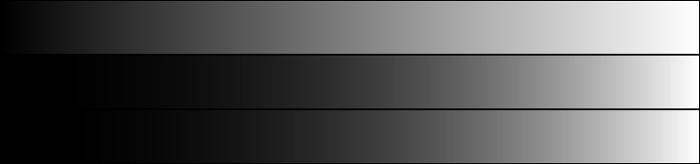

## Работа 1. Исследование гамма-коррекции
автор: Мисютин В. А.
дата: 2022-02-17T21:14:49

### Задание
1. Сгенерировать серое тестовое изображение $I_1$ в виде прямоугольника размером 768х60 пикселя с плавным изменение пикселей от черного к белому, одна градация серого занимает 3 пикселя по горизонтали.
2. Применить  к изображению $I_1$ гамма-коррекцию с коэффициентом из интервала 2.2-2.4 и получить изображение $G_1$ при помощи функци pow.
3. Применить  к изображению $I_1$ гамма-коррекцию с коэффициентом из интервала 2.2-2.4 и получить изображение $G_2$ при помощи прямого обращения к пикселям.
4. Показать визуализацию результатов в виде одного изображения (сверху вниз $I_1$, $G_1$, $G_2$).
5. Сделать замер времени обработки изображений в п.2 и п.3, результаты отфиксировать в отчете.

### Результаты



Рис. 1. Результаты работы программы (сверху вниз $I_1$, $G_1$, $G_2$)

### Текст программы

```cpp
//
// Created by dxxmwrld on 14.02.2022.
//

#include <opencv2/opencv.hpp>
#include <cmath>
#include <chrono>

int main() {

    cv::Mat img(180, 768, CV_8UC1);
    img = 0;
    cv::Rect2d rc = {0, 0, 768, 60};

    double k = (2.2 + 2.4) / 2;

    // 1

    for (int y(0); y < 60; ++y) {
        for (int x(0); x < 768; ++x) {
            img.at<uchar>(y, x) = x / 3;
        }
    }

    cv::rectangle(img, rc, {0}, 0.01f);
    rc.y += rc.height;

    // 2

    {
        cv::Rect2d subrc = {0, 0, 768, 60};

        auto start2 = std::chrono::high_resolution_clock::now();

        cv::Mat new_img{img};
        new_img.convertTo(new_img, CV_64FC1, 1.0f / 255.0f);
        cv::pow(new_img, k, new_img);
        new_img.convertTo(new_img, CV_64FC1, 255.0f);
        new_img(subrc).copyTo(img(rc));

        cv::rectangle(img, rc, {0}, 0.01f);
        rc.y += rc.height;

        auto finish2 = std::chrono::high_resolution_clock::now();
        auto elapsed2 = std::chrono::duration_cast<std::chrono::microseconds>(finish2 - start2);
        std::cout << "second part: " << elapsed2.count() << " microseconds" << std::endl;
    }

    // 3

    {

        auto start3 = std::chrono::high_resolution_clock::now();

        for (int y = 120; y < 180; y++) {
            for (int x = 0; x < 768; x++) {
                img.at<cv::uint8_t>(y, x) =
                        std::pow(img.at<cv::uint8_t>(y - 120, x) / 255.0f, k) * 255.0f;
            }
        }

        auto finish3 = std::chrono::high_resolution_clock::now();
        auto elapsed3 = std::chrono::duration_cast<std::chrono::microseconds>(finish3 - start3);
        std::cout << "third part: " << elapsed3.count() << " microseconds" << std::endl;

        cv::rectangle(img, rc, {0}, 0.01f);
    }
    cv::imwrite("lab01.png", img);
}
```
Среднее время п.2 = 1093мкс, п.3 = 1510мкс

